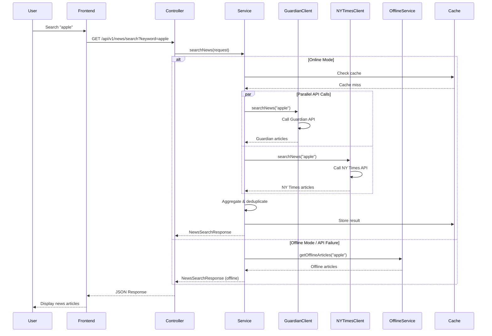

# News Aggregator Architecture

## System Architecture Diagram



## Component Architecture

```
┌─────────────────────────────────────────────────────────────┐
│                    Presentation Layer                       │
├─────────────────────────────────────────────────────────────┤
│  React Frontend (Port 3000)  │  Static HTML (Port 8080)    │
│  - Bootstrap UI               │  - Vanilla JS + Bootstrap   │
│  - Axios HTTP Client          │  - Direct API calls         │
└─────────────────────────────────────────────────────────────┘
                              │
                              ▼
┌─────────────────────────────────────────────────────────────┐
│                    API Gateway Layer                        │
├─────────────────────────────────────────────────────────────┤
│                   Spring Boot (Port 8080)                  │
│  ┌─────────────────┐  ┌─────────────────┐                  │
│  │  NewsController │  │  GlobalException│                  │
│  │  - GET/POST     │  │  Handler        │                  │
│  │  - Validation   │  │  - Error Format │                  │
│  └─────────────────┘  └─────────────────┘                  │
└─────────────────────────────────────────────────────────────┘
                              │
                              ▼
┌─────────────────────────────────────────────────────────────┐
│                    Business Logic Layer                     │
├─────────────────────────────────────────────────────────────┤
│                NewsAggregatorService                        │
│  ┌─────────────────┐  ┌─────────────────┐                  │
│  │  Aggregation    │  │  Deduplication  │                  │
│  │  Logic          │  │  Algorithm      │                  │
│  └─────────────────┘  └─────────────────┘                  │
│  ┌─────────────────┐  ┌─────────────────┐                  │
│  │  Pagination     │  │  Offline        │                  │
│  │  Handler        │  │  Fallback       │                  │
│  └─────────────────┘  └─────────────────┘                  │
└─────────────────────────────────────────────────────────────┘
                              │
                              ▼
┌─────────────────────────────────────────────────────────────┐
│                    Integration Layer                        │
├─────────────────────────────────────────────────────────────┤
│  ┌─────────────────┐  ┌─────────────────┐                  │
│  │ GuardianClient  │  │ NYTimesClient   │                  │
│  │ - WebClient     │  │ - WebClient     │                  │
│  │ - JSON Parsing  │  │ - JSON Parsing  │                  │
│  └─────────────────┘  └─────────────────┘                  │
│  ┌─────────────────┐  ┌─────────────────┐                  │
│  │ OfflineService  │  │ CacheManager    │                  │
│  │ - Static Data   │  │ - Spring Cache  │                  │
│  └─────────────────┘  └─────────────────┘                  │
└─────────────────────────────────────────────────────────────┘
                              │
                              ▼
┌─────────────────────────────────────────────────────────────┐
│                    External APIs                            │
├─────────────────────────────────────────────────────────────┤
│  ┌─────────────────┐  ┌─────────────────┐                  │
│  │ Guardian API    │  │ NY Times API    │                  │
│  │ content.        │  │ api.nytimes.    │                  │
│  │ guardianapis.   │  │ com             │                  │
│  │ com             │  │                 │                  │
│  └─────────────────┘  └─────────────────┘                  │
└─────────────────────────────────────────────────────────────┘
```

## Design Patterns Implementation

### 1. Strategy Pattern
```java
// Different API clients with same interface
public interface NewsApiClient {
    Mono<List<NewsArticle>> searchNews(String keyword, int page, int pageSize);
}

@Component
public class GuardianApiClient implements NewsApiClient { ... }

@Component  
public class NYTimesApiClient implements NewsApiClient { ... }
```

### 2. Builder Pattern
```java
@Builder
public class NewsArticle {
    private String title;
    private String description;
    // ... other fields
}

NewsArticle article = NewsArticle.builder()
    .title("Title")
    .description("Description")
    .build();
```

### 3. Template Method Pattern
```java
public abstract class BaseApiClient {
    public final Mono<List<NewsArticle>> searchNews(String keyword) {
        return callApi(keyword)
            .map(this::parseResponse)
            .onErrorReturn(getDefaultResponse());
    }
    
    protected abstract Mono<String> callApi(String keyword);
    protected abstract List<NewsArticle> parseResponse(String response);
}
```

### 4. Observer Pattern (Reactive Streams)
```java
// Reactive programming with WebFlux
public Mono<NewsSearchResponse> searchNews(NewsSearchRequest request) {
    return Mono.zip(
        guardianClient.searchNews(request.getKeyword()),
        nyTimesClient.searchNews(request.getKeyword())
    ).map(this::aggregateResults);
}
```

### 5. Factory Pattern
```java
@Configuration
public class WebClientConfig {
    @Bean
    public WebClient webClient() {
        return WebClient.builder()
            .codecs(configurer -> configurer.defaultCodecs().maxInMemorySize(1024 * 1024))
            .build();
    }
}
```

## Data Flow Architecture

### Request Flow
1. **User Input** → Frontend form submission
2. **HTTP Request** → GET/POST to `/api/v1/news/search`
3. **Validation** → Spring Validation annotations
4. **Service Layer** → Business logic execution
5. **Parallel API Calls** → Guardian + NY Times APIs
6. **Aggregation** → Combine and deduplicate results
7. **Response** → JSON formatted response
8. **UI Update** → Display articles with pagination

### Error Handling Flow
1. **API Failure** → Automatic fallback to offline mode
2. **Validation Error** → Return 400 with error details
3. **Network Timeout** → Retry mechanism
4. **Unexpected Error** → Return 500 with generic message

## Security Architecture

### API Key Management
```yaml
# Environment-based configuration
guardian:
  api:
    key: ${GUARDIAN_API_KEY:default-key}

nytimes:
  api:
    key: ${NYTIMES_API_KEY:default-key}
```

### Input Validation
```java
@Valid
public class NewsSearchRequest {
    @NotBlank(message = "Search keyword is required")
    private String keyword;
    
    @Min(value = 1, message = "Page number must be greater than 0")
    private int page;
}
```

### CORS Configuration
```java
@CrossOrigin(origins = "*")
@RestController
public class NewsController { ... }
```

## Performance Architecture

### Caching Strategy
```java
@Cacheable(value = "newsCache", key = "#request.keyword + '_' + #request.page")
public Mono<NewsSearchResponse> searchNews(NewsSearchRequest request) { ... }
```

### Reactive Programming
- Non-blocking I/O with WebFlux
- Parallel API calls using `Mono.zip()`
- Backpressure handling
- Memory-efficient streaming

### Connection Pooling
```java
@Bean
public WebClient webClient() {
    return WebClient.builder()
        .codecs(configurer -> configurer.defaultCodecs().maxInMemorySize(1024 * 1024))
        .build();
}
```

## Scalability Architecture

### Horizontal Scaling
- Stateless service design
- External configuration
- Load balancer ready
- Database-free (can be extended)

### Vertical Scaling
- JVM tuning parameters
- Memory optimization
- Garbage collection tuning
- Connection pool sizing

## Monitoring Architecture

### Health Checks
```yaml
management:
  endpoints:
    web:
      exposure:
        include: health,info,metrics,prometheus
  endpoint:
    health:
      show-details: always
```

### Metrics Collection
- Response time tracking
- Error rate monitoring
- Cache hit/miss ratios
- API call success rates

## Deployment Architecture

### Docker Container
```dockerfile
FROM openjdk:8-jdk-alpine
WORKDIR /app
COPY target/news-aggregator-1.0.0.jar app.jar
EXPOSE 8080
ENTRYPOINT ["java", "-jar", "app.jar"]
```

### CI/CD Pipeline
1. **Source Control** → Git repository
2. **Build** → Maven compilation
3. **Test** → Unit + Integration tests
4. **Quality** → Code coverage + static analysis
5. **Package** → JAR + Docker image
6. **Deploy** → Staging → Production

## Technology Stack Rationale

### Backend Choices
- **Java 8+**: Compatible with legacy systems and wide deployment support  
- **Spring Boot 2.7**: Stable LTS version with production-proven reliability
- **WebFlux**: Reactive programming for better resource utilization
- **Maven**: Mature build tool with extensive plugin ecosystem

### Frontend Choices
- **React 18**: Modern UI library with hooks
- **Bootstrap 5**: Responsive design framework
- **Vanilla JS Option**: No build process required

### Testing Choices
- **JUnit 5**: Modern testing framework
- **Mockito**: Mocking framework for unit tests
- **Cucumber**: BDD testing for business requirements
- **WebTestClient**: Reactive web testing

This architecture ensures scalability, maintainability, and production readiness while following enterprise best practices and design patterns.